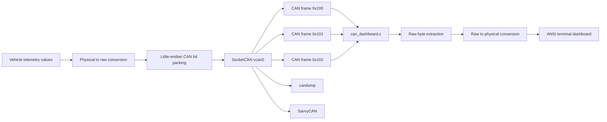
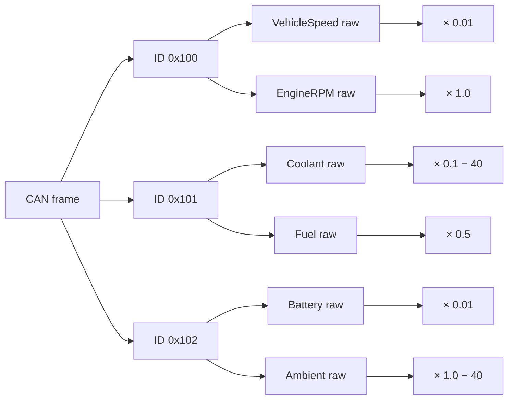

# AI-Assisted DBC Generation and CAN Data Visualization Using SocketCAN

## 1. System Overview

This project simulates a vehicle telemetry network on Linux using:

- SocketCAN;
- Linux Virtual CAN (`vcan0`);
- a Vector-style CAN database (`vehicle.dbc`);
- a CAN transmitter written in C;
- a live CAN dashboard written in C;
- SavvyCAN or `candump` for independent traffic verification.

### 1.1 Communication Architecture



## 1.2 Telemetry Signal Matrix

| CAN ID | CAN ID Dec | Message | Signal | Start Bit | Length | Byte Order | Factor | Offset | Range | Unit |
|---|---:|---|---|---:|---:|---|---:|---:|---|---|
| `0x100` | 256 | VehicleStatus | VehicleSpeed | 0 | 16 | Little | 0.01 | 0 | 0–120 | km/h |
| `0x100` | 256 | VehicleStatus | EngineRPM | 16 | 16 | Little | 1.0 | 0 | 800–5000 | rpm |
| `0x101` | 257 | ThermalFuel | CoolantTemperature | 0 | 16 | Little | 0.1 | -40 | -40–120 | degC |
| `0x101` | 257 | ThermalFuel | FuelLevel | 16 | 8 | Little | 0.5 | 0 | 0–100 | % |
| `0x102` | 258 | PowerStatus | BatteryVoltage | 0 | 16 | Little | 0.01 | 0 | 11–15 | V |
| `0x102` | 258 | PowerStatus | AmbientTemperature | 16 | 8 | Little | 1.0 | -40 | -40–100 | degC |

## 1.3 Mathematical Encoding and Decoding

Encoding:

`Raw = (Physical - Offset) / Factor`

Decoding:

`Physical = Raw × Factor + Offset`

The implementation intentionally keeps the same equations in both directions.

### Example

For coolant temperature:

`Physical = Raw × 0.1 - 40`

At `80 degC`:

`Raw = (80 + 40) / 0.1 = 1200`

The low byte is stored first because the selected DBC representation is little-endian (`@1+`).

## 1.4 Bit and Byte Layout

### `0x100` VehicleStatus

```text
Byte 0       Byte 1       Byte 2       Byte 3       Byte 4..7
+------------+------------+------------+------------+----------------+
| Speed LSB  | Speed MSB  | RPM LSB    | RPM MSB    | Reserved       |
+------------+------------+------------+------------+----------------+
```

### `0x101` ThermalFuel

```text
Byte 0       Byte 1       Byte 2       Byte 3..7
+------------+------------+------------+-------------------------+
| Coolant    | Coolant    | Fuel       | Reserved                |
| LSB        | MSB        |            |                         |
+------------+------------+------------+-------------------------+
```

### `0x102` PowerStatus

```text
Byte 0       Byte 1       Byte 2       Byte 3..7
+------------+------------+------------+-------------------------+
| Battery    | Battery    | Ambient    | Reserved                |
| LSB        | MSB        |            |                         |
+------------+------------+------------+-------------------------+
```

## 2. File Structure

```text
AI-Assisted-DBC-SocketCAN-Visualization/
├── vehicle.dbc
├── can_transmitter.c
├── can_dashboard.c
├── AI_USAGE_REPORT.md
└── README.md
```

## 3. Linux Prerequisites

The commands below assume a Debian/Ubuntu-style Linux system.

Install the basic toolchain:

```bash
sudo apt update
sudo apt install -y build-essential can-utils iproute2 git
```

For SavvyCAN, use the current release appropriate to your Linux system.

## 4. Create the Virtual CAN Interface

Load the kernel module:

```bash
sudo modprobe vcan
```

Create the interface:

```bash
sudo ip link add dev vcan0 type vcan
```

Bring it up:

```bash
sudo ip link set up vcan0
```

Verify:

```bash
ip -details link show vcan0
```

You should see a CAN interface named `vcan0` in the `UP` state.

If the interface already exists, use:

```bash
sudo ip link set up vcan0
```

## 5. Compile the Programs

Compile the transmitter:

```bash
gcc -std=c11 -Wall -Wextra -Wpedantic -O2 can_transmitter.c -lm -o can_transmitter
```

Compile the dashboard:

```bash
gcc -std=c11 -Wall -Wextra -Wpedantic -O2 can_dashboard.c -o can_dashboard
```

Confirm:

```bash
ls -lh can_transmitter can_dashboard
```

## 6. Multi-Terminal Test Procedure

### Terminal 1 — CAN capture

```bash
candump vcan0
```

Keep this running.

### Terminal 2 — Dashboard

```bash
./can_dashboard
```

The terminal should show the live decoded values.

### Terminal 3 — Transmitter

```bash
./can_transmitter
```

The transmitter updates all three CAN messages at 100 ms intervals.

## 7. What You Should Observe

`candump` should show identifiers similar to:

```text
vcan0  100   [8]  XX XX XX XX XX XX XX XX
vcan0  101   [8]  XX XX XX XX XX XX XX XX
vcan0  102   [8]  XX XX XX XX XX XX XX XX
```

The exact bytes change because the transmitter deliberately simulates moving vehicle conditions.

The dashboard converts those raw bytes back into:

- vehicle speed;
- engine RPM;
- coolant temperature;
- fuel level;
- battery voltage;
- ambient temperature.

## 8. Independent Raw-Frame Checks

Use:

```bash
candump -L vcan0
```

The `-L` option is useful when you want a log-style representation.

To inspect only `0x100`:

```bash
candump vcan0,100:7FF
```

To inspect `0x101`:

```bash
candump vcan0,101:7FF
```

To inspect `0x102`:

```bash
candump vcan0,102:7FF
```

## 9. SavvyCAN Workflow

SavvyCAN can be used as an independent visualization layer.

### 9.1 Connect the CAN source

Start the SocketCAN/vcan interface and open SavvyCAN.

Choose a SocketCAN-compatible connection and select:

```text
vcan0
```

The exact menu wording may vary by SavvyCAN version.

### 9.2 Confirm raw traffic

With `./can_transmitter` running, verify that frames with IDs:

```text
100
101
102
```

are arriving.

### 9.3 Load the DBC

Use SavvyCAN's DBC/database loading workflow to import:

```text
vehicle.dbc
```

The database maps raw bytes into named signals and engineering units.

### 9.4 Configure plots

Useful plots are:

- VehicleSpeed versus time;
- EngineRPM versus time;
- CoolantTemperature versus time;
- FuelLevel versus time;
- BatteryVoltage versus time;
- AmbientTemperature versus time.

The smooth oscillation in the transmitter should produce smooth curves rather than random jumps.

### 9.5 Validation philosophy

Do not use SavvyCAN as the only validation method.

The recommended evidence chain is:

```text
C transmitter
    ↓
candump raw frame
    ↓
DBC decode in SavvyCAN
    ↓
manual equation check
    ↓
C dashboard decoded value
```

Agreement between the independent paths is stronger evidence than a visually pleasing plot alone.

## 10. ANSI Dashboard

`can_dashboard.c` uses ANSI escape sequences to clear and redraw the terminal.

It displays:

```text
Vehicle Speed
Engine RPM
Coolant Temperature
Fuel Level
Battery Voltage
Ambient Temperature
```

The dashboard only accepts standard 11-bit frames matching the three configured identifiers.

## 11. Detailed Decoder Logic

The receiver obtains a Linux `struct can_frame`.

For `0x100`:

```text
data[0] + data[1] → VehicleSpeed raw
data[2] + data[3] → EngineRPM raw
```

For `0x101`:

```text
data[0] + data[1] → CoolantTemperature raw
data[2]           → FuelLevel raw
```

For `0x102`:

```text
data[0] + data[1] → BatteryVoltage raw
data[2]           → AmbientTemperature raw
```

The two-byte fields are reconstructed with:

```c
raw = data[0] | (data[1] << 8);
```

That expression is the C equivalent of the selected little-endian byte order.

## 12. DBC Transformation Pipeline

```mermaid
flowchart TD
    P[Physical signal]
    E[Raw = (Physical - Offset) / Factor]
    R[Unsigned raw integer]
    B[Little-endian byte packing]
    F[CAN frame]
    X[SocketCAN]
    U[Raw byte extraction]
    D[Physical = Raw × Factor + Offset]
    O[Engineering-unit signal]

    P --> E --> R --> B --> F --> X --> U --> D --> O
```

## 13. Signal-Specific Decoding Pipeline



## 14. Experimental Analysis

### 14.1 Raw versus decoded data

Raw CAN bytes have no useful human meaning without the database specification.

For example, the same byte value can represent:

- speed;
- voltage;
- temperature;
- a counter;

depending on the signal definition.

The DBC provides the mapping from bits to engineering semantics.

### 14.2 Scaling errors

A factor error changes the magnitude of the signal.

Example:

Correct battery scaling:

`1420 × 0.01 = 14.20 V`

Incorrect factor `0.1` would produce:

`1420 × 0.1 = 142 V`

### 14.3 Offset errors

For coolant:

Correct:

`1200 × 0.1 - 40 = 80 degC`

Ignoring the offset produces:

`1200 × 0.1 = 120 degC`

That is physically inconsistent with the actual intended value.

### 14.4 Endianness errors

If the two bytes of a 16-bit field are reversed, a valid raw number can become a completely different number.

For example:

```text
Correct raw 0x04B0 → 1200
Reversed   0xB004 → 45060
```

Therefore a frame can be syntactically valid while the decoded signal is wrong.

## 15. Boundary Test Table

| Signal | Minimum Physical | Raw Minimum | Maximum Physical | Raw Maximum |
|---|---:|---:|---:|---:|
| VehicleSpeed | 0 km/h | 0 | 120 km/h | 12000 |
| EngineRPM | 800 rpm | 800 | 5000 rpm | 5000 |
| CoolantTemperature | -40 degC | 0 | 120 degC | 1600 |
| FuelLevel | 0% | 0 | 100% | 200 |
| BatteryVoltage | 11 V | 1100 | 15 V | 1500 |
| AmbientTemperature | -40 degC | 0 | 100 degC | 140 |

## 16. Troubleshooting

### `Cannot find device "vcan0"`

Run:

```bash
sudo modprobe vcan
sudo ip link add dev vcan0 type vcan
sudo ip link set up vcan0
```

If creation reports that it already exists, simply bring it up:

```bash
sudo ip link set up vcan0
```

### `bind: No such device`

The C program cannot find the interface.

Check:

```bash
ip link show vcan0
```

### Dashboard remains blank

Start the programs in this order:

```text
candump
    ↓
dashboard
    ↓
transmitter
```

### `candump` shows frames but decoded values are wrong

Check, in order:

1. CAN ID;
2. DLC;
3. signal start bit;
4. signal length;
5. little-endian interpretation;
6. factor;
7. offset.

Do not change the decoder until the raw bytes have been inspected.

## 17. Git Repository Setup

Move into the project directory:

```bash
cd ai_dbc_socketcan_friend
```

Initialize Git:

```bash
git init
```

Set the primary branch:

```bash
git branch -M main
```

Add all project files:

```bash
git add vehicle.dbc can_transmitter.c can_dashboard.c AI_USAGE_REPORT.md README.md
```

Review the staged files:

```bash
git status
```

Create the first commit:

```bash
git commit -m "Add SocketCAN DBC telemetry simulator"
```

## 18. GitHub CLI Deployment

Install GitHub CLI if it is not already installed, then authenticate:

```bash
gh auth login
```

Create the GitHub repository from the local directory:

```bash
gh repo create REPO_NAME --public --source=. --remote=origin --push
```

Replace `REPO_NAME` with the actual repository name.

Alternatively, if a remote repository already exists:

```bash
git remote add origin https://github.com/GITHUB_USERNAME/REPO_NAME.git
git push -u origin main
```

Verify:

```bash
git remote -v
git log --oneline --decorate -5
```

## 19. Suggested Repository Name

```text
AI-Assisted-DBC-SocketCAN-Visualization
```

A distinct alternative repository name for a second student implementation could be:

```text
SocketCAN-Vehicle-Telemetry-DBC-Lab
```

## 20. Final Submission Checklist

- [ ] `vehicle.dbc` opens as a DBC file.
- [ ] IDs use decimal notation in `BO_` definitions.
- [ ] All six signals are present.
- [ ] `can_transmitter.c` compiles without warnings.
- [ ] `can_dashboard.c` compiles without warnings.
- [ ] `vcan0` is operational.
- [ ] `candump vcan0` shows all three identifiers.
- [ ] dashboard displays changing physical values.
- [ ] manual raw/physical calculations match.
- [ ] SavvyCAN can observe/import the traffic.
- [ ] Mermaid diagrams render in GitHub Markdown.
- [ ] `AI_USAGE_REPORT.md` is included.
- [ ] Git repository is committed.
- [ ] GitHub remote is configured.
- [ ] `main` branch is pushed.
